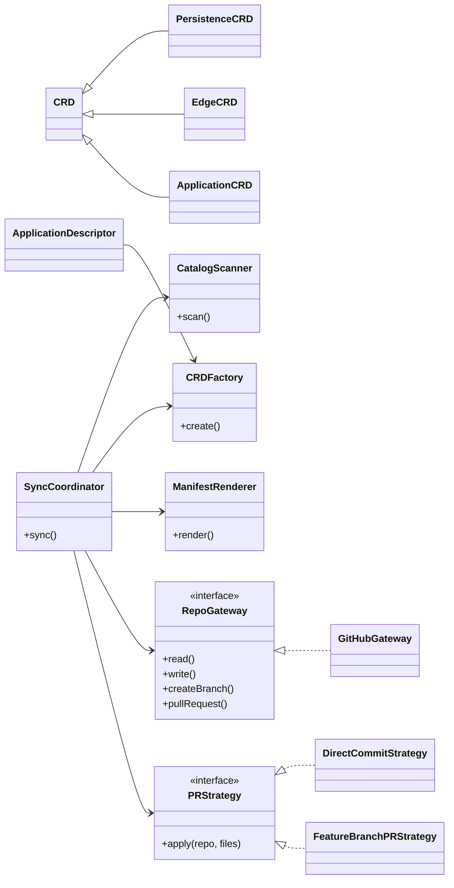

```mermaid
classDiagram
direction LR
class ApplicationDescriptor

    class CRD
    class PersistenceCRD
    class EdgeCRD
    class ApplicationCRD

    class CatalogScanner{
        +scan()
    }
    class CRDFactory{
        +create()
    }
    class ManifestRenderer{
        +render()
    }
    class RepoGateway{
        <<interface>>
        +read()
        +write()
        +createBranch()
        +pullRequest()
    }
    class GitHubGateway

    class PRStrategy{
        <<interface>>
        +apply(repo, files)
    }
    class DirectCommitStrategy
    class FeatureBranchPRStrategy

    class SyncCoordinator{
        +sync()
    }

    CRD <|-- PersistenceCRD
    CRD <|-- EdgeCRD
    CRD <|-- ApplicationCRD
    RepoGateway <|.. GitHubGateway
    PRStrategy <|.. DirectCommitStrategy
    PRStrategy <|.. FeatureBranchPRStrategy

    SyncCoordinator --> CatalogScanner
    SyncCoordinator --> CRDFactory
    SyncCoordinator --> ManifestRenderer
    SyncCoordinator --> RepoGateway
    SyncCoordinator --> PRStrategy
    ApplicationDescriptor --> CRDFactory
```

