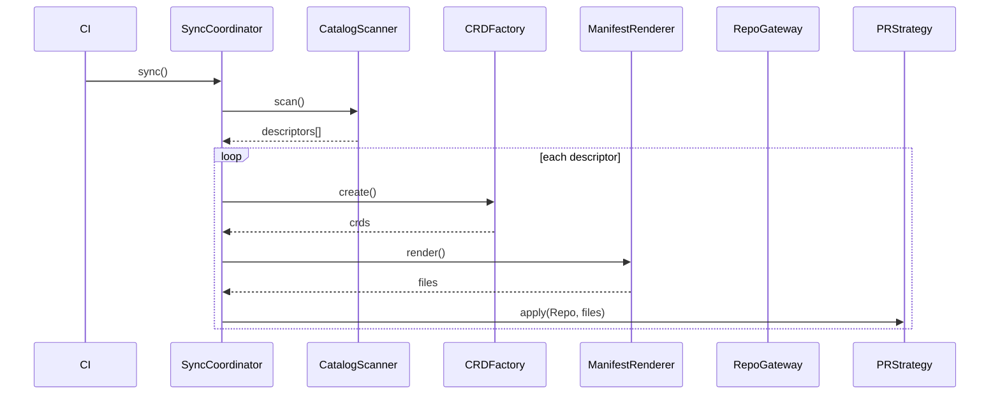

```mermaid
sequenceDiagram
    participant CI
    participant Coordinator as SyncCoordinator
    participant Scanner as CatalogScanner
    participant Factory as CRDFactory
    participant Renderer as ManifestRenderer
    participant Repo as RepoGateway
    participant Strategy as PRStrategy

    CI->>Coordinator: sync()
    Coordinator->>Scanner: scan()
    Scanner-->>Coordinator: descriptors[]
    loop each descriptor
        Coordinator->>Factory: create()
        Factory-->>Coordinator: crds
        Coordinator->>Renderer: render()
        Renderer-->>Coordinator: files
        Coordinator->>Strategy: apply(Repo, files)
    end
```